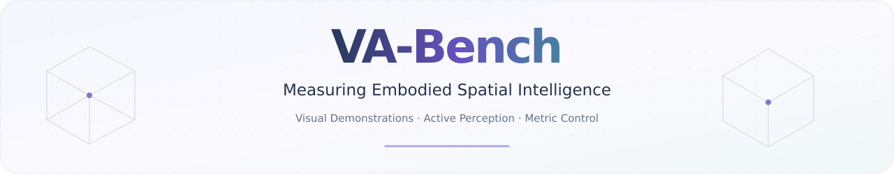
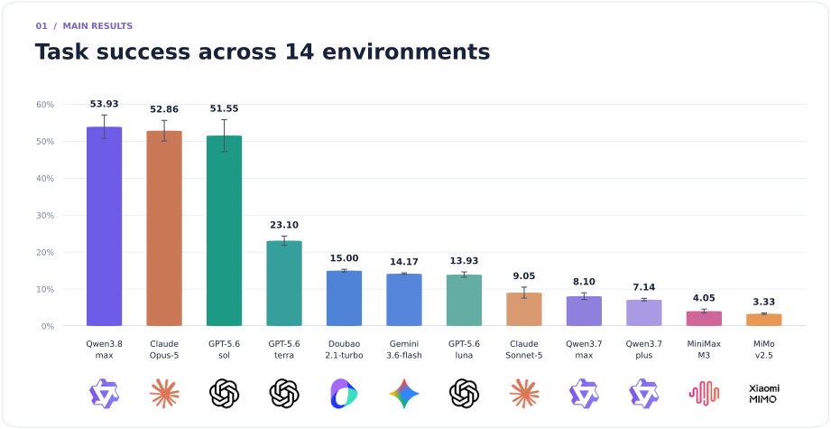
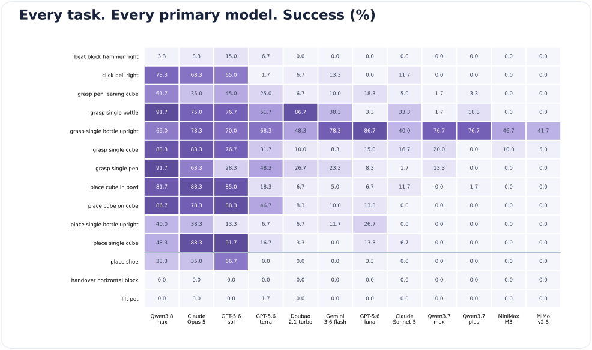
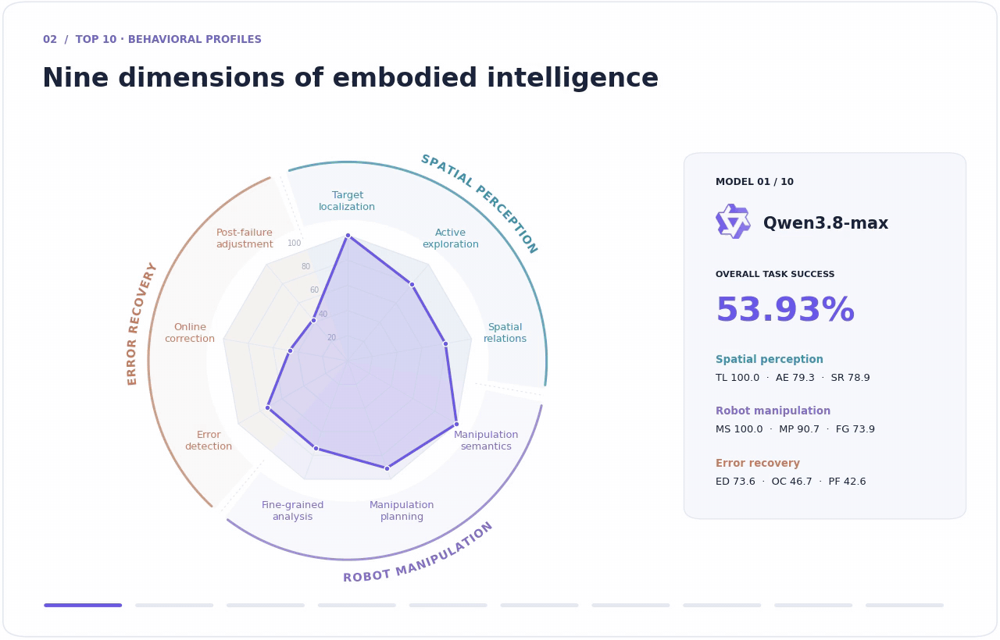

<p align="center">
  
</p>

<p align="center">
Zhongbo Zhang<sup>1,*</sup> · Jiayi Jin<sup>1,*</sup> · Yifan Wang<sup>1</sup> · Zaibin Zhang<sup>1</sup><br>
Haiwen Diao<sup>2</sup> · Lijun Wang<sup>1</sup> · Huchuan Lu<sup>1</sup>
</p>

<p align="center">
<sup>1</sup> Dalian University of Technology &nbsp;&nbsp; <sup>2</sup> Nanyang Technological University<br>
<sub>* Equal contribution</sub>
</p>

<p align="center">
  <a href="docs/paper/VA-Bench-preview.pdf" title="Read the paper preview (39 pages; Figure 3 on page 33 is pending)">
    
  </a>
</p>

<p align="center">
<a href="#task-success">Results</a> &nbsp; / &nbsp;
<a href="#behavioral-profiles">Capability profiles</a> &nbsp; / &nbsp;
<a href="#quick-start">Quick start</a> &nbsp; / &nbsp;
<a href="https://github.com/zhangzhongbo2213/VA-Bench-test/releases/tag/assets-v1">Download assets</a>
</p>

**Embodied spatial intelligence, tested through action.** VA-Bench evaluates the
complete observe–reason–act–revise loop. From RGB-only demonstrations, multimodal
models learn task context, actively choose camera viewpoints, issue metric Cartesian
commands, and revise their actions using execution feedback. We evaluate 12 models
on 14 manipulation tasks, combining strict task success with nine behavioral
diagnostics of perception, manipulation, and recovery.

## Task success

<p align="center">
  
</p>

<details>
<summary><strong>View exact scores and all 14 task results</strong></summary>

Each run covers **11 single-arm and 3 dual-arm tasks**, with 20 physically verified
seeds per task. Bars show the mean of the three run-level task macro-averages;
error bars show sample standard deviation. The top three means are close and their
run-level ranges overlap.

| Model | Success | Run-to-run SD |
|:--|--:|--:|
| Qwen3.8-max | 53.93% | 3.17 pp |
| Opus-5 | 52.86% | 2.79 pp |
| GPT-5.6-sol | 51.55% | 4.31 pp |
| GPT-5.6-terra | 23.10% | 1.25 pp |
| Doubao-seed-2.1-turbo | 15.00% | 0.36 pp |
| Gemini-3.6-flash | 14.17% | 0.21 pp |
| GPT-5.6-luna | 13.93% | 0.71 pp |
| Sonnet-5 | 9.05% | 1.49 pp |
| Qwen3.7-max | 8.10% | 0.90 pp |
| Qwen3.7-plus | 7.14% | 0.36 pp |
| MiniMax-M3 | 4.05% | 0.55 pp |
| MiMo-v2.5 | 3.33% | 0.21 pp |




[Per-task CSV](docs/data/success_by_task.csv) · [Figure data](docs/data/results.json) · [Sources and aggregation](docs/data/SOURCES.md)

</details>

## Behavioral profiles

<p align="center">
  
</p>

<p align="center">
  <a href="docs/interactive/radar.html"><strong>▶ Interactive radar · Pause &amp; select a model</strong></a><br>
  <sub>Download the HTML file and open it in a browser.</sub>
</p>

<details>
<summary><strong>Read the nine dimensions</strong></summary>

The tour follows the **top 10 models by overall task success**. Each profile pools
applicable single- and dual-arm episodes from one annotated run; the three recovery
scores exclude error-free episodes. Smooth transitions connect the recorded profiles.

| Spatial perception | Robot manipulation | Error recovery |
|:--|:--|:--|
| **TL** Target localization | **MS** Manipulation semantics | **ED** Error detection |
| **AE** Active exploration | **MP** Manipulation planning | **OC** Online correction |
| **SR** Spatial relations | **FG** Fine-grained pre-contact analysis | **PF** Post-failure adjustment |

Sonnet-5 uses its second annotated run; the other primary models use their first.
The radar describes observed behaviors, while the success chart measures completed
tasks. [Static profile](docs/media/capabilities_poster.png) · [MP4 animation](docs/media/capabilities_top10.mp4)

</details>

## Quick start

**All assets required by the 14 main tasks are provided with this VA-Bench release.**
No separate asset download from RoboTwin is needed. If `assets/` is already present,
start below; otherwise, extract the release's [asset bundle](https://github.com/zhangzhongbo2213/VA-Bench-test/releases/tag/assets-v1)
into the repository root as described in the [setup guide](docs/SETUP.md).

Use your existing RoboTwin environment, or follow the setup guide to create a new one:

```bash
conda activate RoboTwin
cd VA-Bench
python -m pip install --no-deps --no-build-isolation -e ./agent -e ./active_spatial_benchmark_xyz
python script/check_setup.py
```

Connect your vision-language model and start with one episode:

```bash
export AGENT_BASE_URL="http://localhost:8000/v1"
export AGENT_MODEL="your-model-name"
export AGENT_API_KEY="EMPTY"

python script/run_benchmark.py --run-id smoke \
  --tasks grasp_single_cube --num-seeds 1 --gpus 0 --parallel 1
```

Run all 14 tasks and monitor progress:

```bash
python script/run_benchmark.py --run-id full --gpus 0 1 --parallel 3
python script/monitor.py --run-id full
```

[Environment & asset setup](docs/SETUP.md) · [Tasks & validated seeds](configs/main_tasks.json) · [Asset release](https://github.com/zhangzhongbo2213/VA-Bench-test/releases/tag/assets-v1)

---

Built on RoboTwin. [MIT License](LICENSE) · [Model logo credits](docs/media/logos/SOURCES.md)
